# Prototype view — 2026-07-17

Fresh read of the playable prototype on `claude/intelligent-fermi-yyigzo` tip
(`e719259`). Headless smokes: `boot_smoke` **PASS**, `layer_spine_smoke` **PASS**.

## Play it (phone / browser)

1. Open **https://joeholloway445-maker.github.io/CATSINO.CASINO/**
2. Tap **Play Offline**
3. Tap **🧪 Play Prototype Spine**

That walks the Gate-3 spine: Liminal → Metroplex archway → city → HiddenDoor →
short Periliminal pull (~8s in prototype mode) → blessing door out.

Local desktop: open `godot/project.godot` in Godot 4.3+, F5, same button.
Local web rebuild: `bash scripts/export_web.sh && bash scripts/serve_web.sh`.

> Pages ships a **slim** Web pack (music / OSM city shells / HDRI / duplicate
> human slots excluded for GitHub size limits). Desktop Godot has the full art set.

Older zip: [prototype-web-v0.1 release](https://github.com/joeholloway445-maker/CATSINO.CASINO/releases/tag/prototype-web-v0.1)
(Jul 15 — superseded by the Pages rebuild above).

## What you see now

Screenshots from a full in-engine tour (`screenshot_tour.gd`, 58 scenes, 0 fails):

| Screen | Shot |
|---|---|
| Splash / boot | 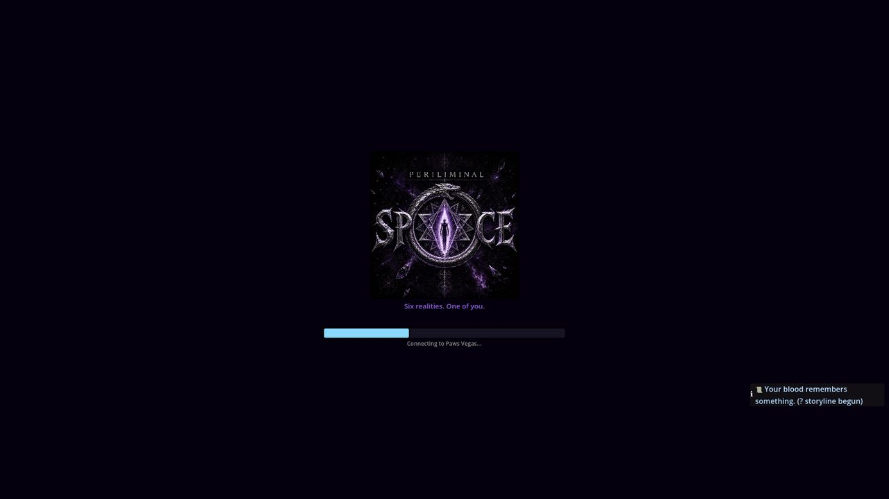 |
| Title + **Play Prototype Spine** | 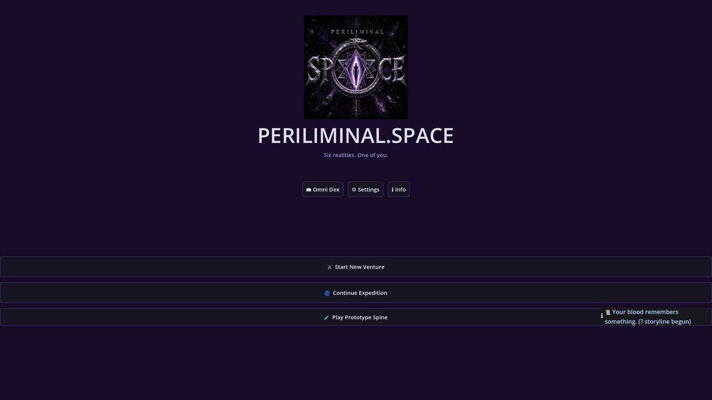 |
| Main menu districts | 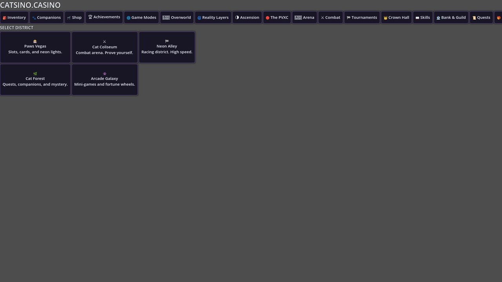 |
| Arlington Arena modes | 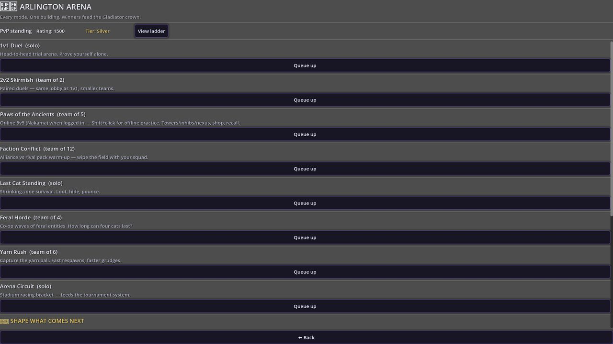 |
| Reality layer select | 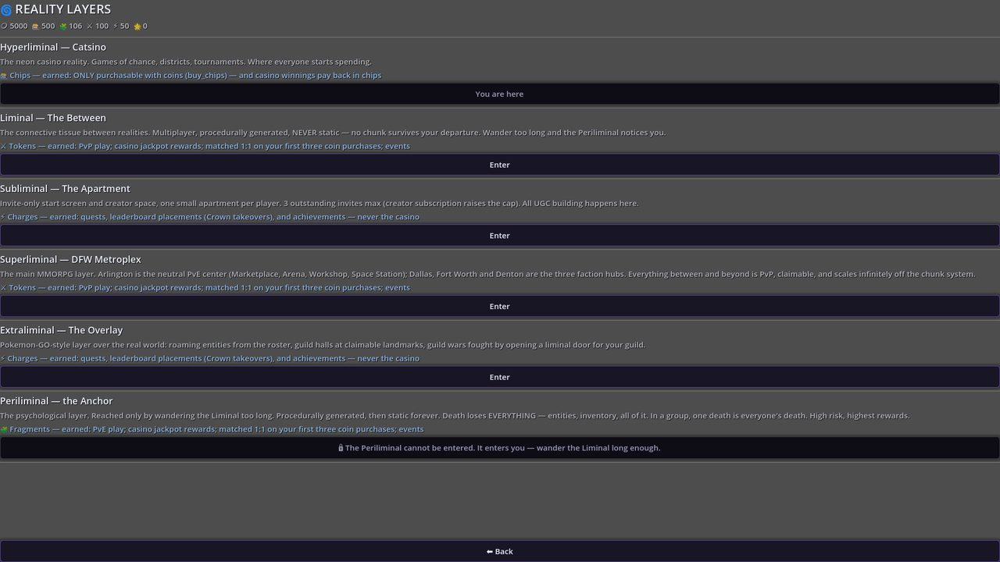 |
| Liminal (Between) | 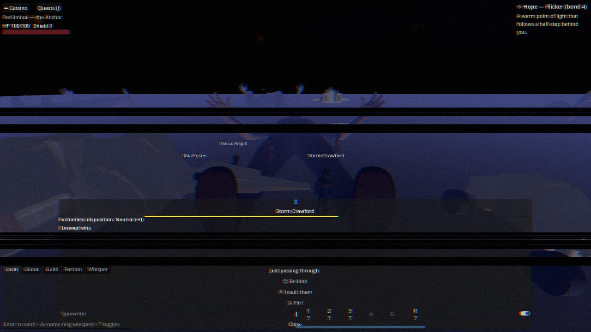 |
| Supraliminal / DFW Metroplex | 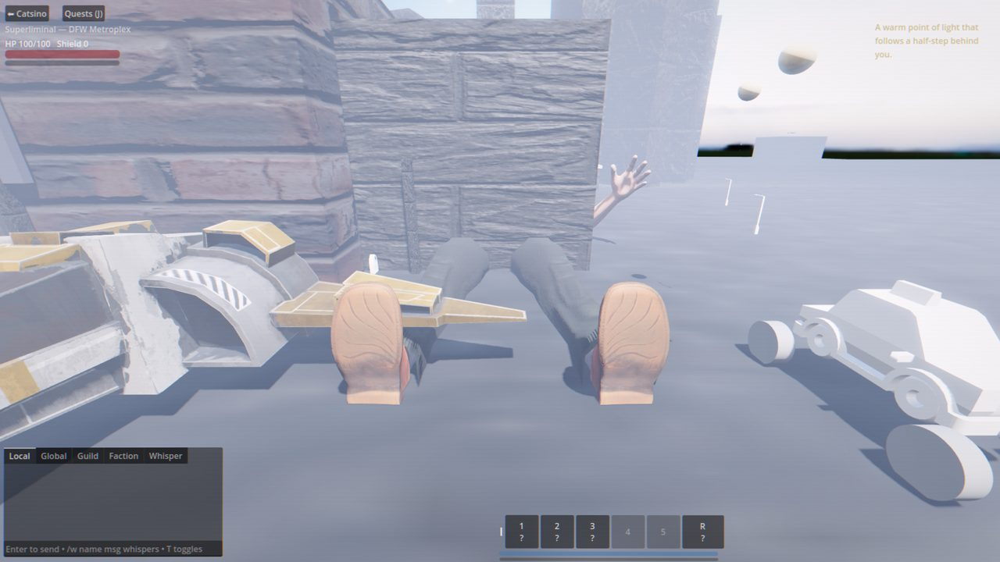 |
| Periliminal gauntlet | 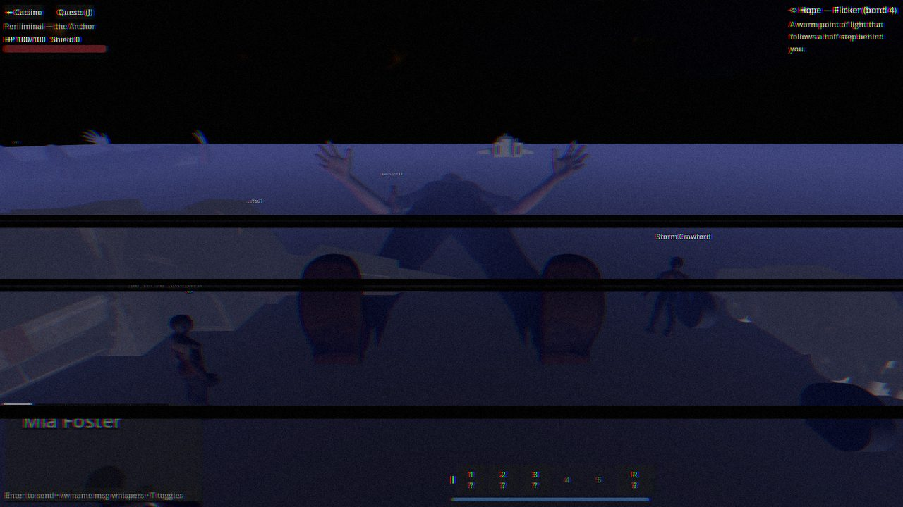 |
| Extraliminal | 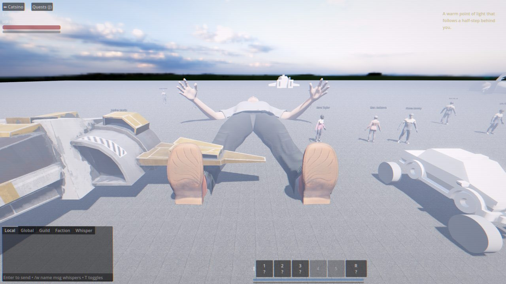 |
| Paws Vegas lobby | 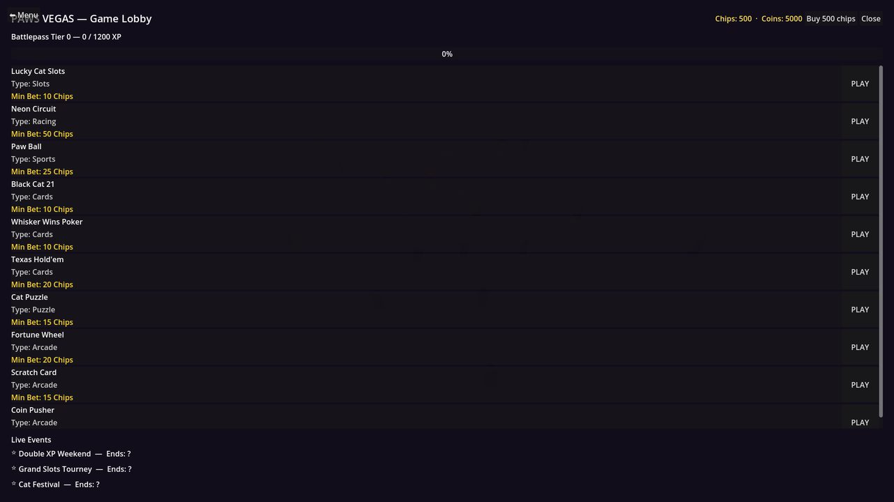 |
| Slots | 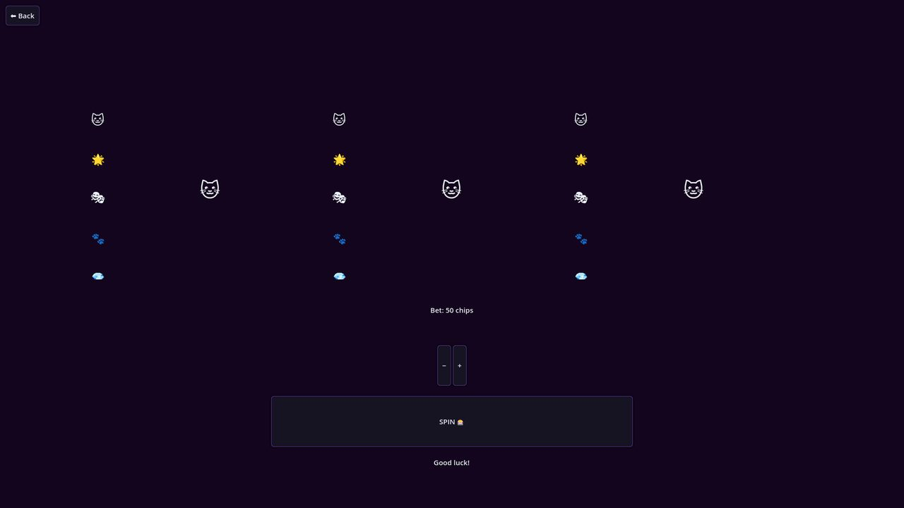 |

Full-res PNGs for this tour live in the agent artifacts folder
(`/opt/cursor/artifacts/screenshots/`) when captured in Cloud.

## What’s in since the Jul 15 web publish

- **Play Prototype Spine** title path + 8s pull (still the one-tap demo)
- Mobile touch stick / bigger buttons / Periliminal splash branding
- PeriHumans (MPFB / Blender Studio) in ship slots (desktop-full)
- OSM2World DFW city shells (desktop-full; slim on Web)
- All arena modes playable offline (duel, 2v2, MOBA practice, survival, zombies, CTF, race)
- Online 5v5 MOBA via Nakama when logged in
- Offline casino / Paws Vegas lobby (slots, blackjack, poker, holdem, scratch, fortune, racing, paw ball, …)
- Subliminal apartment economy gates, chips floor, quest HUD juice
- Dialogue trees + faction quests wired through boot

## Honest visual notes (from this capture)

- Title / splash / menus: branded and readable.
- Layer worlds render with HUD, NPCs, Hope companion, and reality-bend post FX.
- Supraliminal still shows some overexposed / untextured prop spots in the
  screenshot-tour camera pose — walkable city builders are better in live play
  than a fixed early-frame capture suggests.
- Web slim build trades music + heavy city shells for a Pages-sized pack;
  use desktop Godot for the ESO visual bar.

## Verify locally

```bash
godot --headless --path godot -s res://src/dev/boot_smoke.gd
godot --headless --path godot -s res://src/dev/layer_spine_smoke.gd
# Optional screenshot tour (needs X11 / xvfb + OpenGL):
SHOT_OUT=/tmp/shots xvfb-run -a godot --path godot --display-driver x11 \
  --rendering-driver opengl3 -s res://src/dev/screenshot_tour.gd
```
